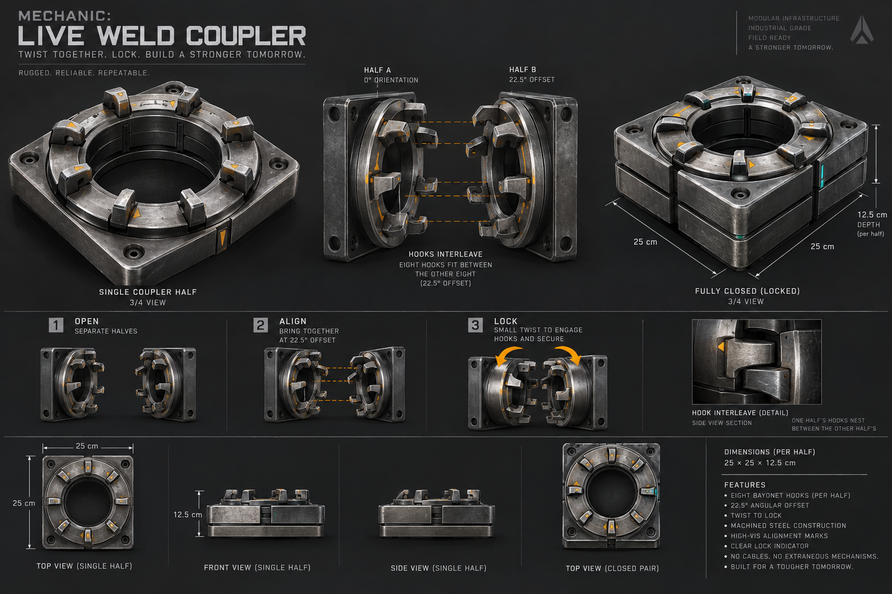

# Coupler: live welding

The Coupler is a half-block bayonet connector: **25 × 25 × 12.5 cm**.
Its positive local Y face carries eight hooks. Two opposing halves align with
a 22.5° hook offset, then twist into a square, full-block envelope before they
become one rigid body.

## Use

1. Choose **Matter Manipulator → Item Placer → Coupler**. Place one on each
   creation, with their ring faces pointing towards each other.
2. Use **Connector** to wire a coupler to a Controller. Aim at the coupler with
   Connector to assign an activation key.
3. Connect a Seat to that Controller, or connect a Button to it and assign the
   same key. Either coupler can initiate the connection; the other can be passive.
4. Bring the ring faces within 7 cm, facing each other. Magnetic alignment begins
   automatically. Press the assigned key while they are aligning to grip.
5. The pair twists over at least 1.2 simulated seconds. The indicator turns green
   only after the live connection is published as a rigid body.

A lock is permanent, like a weld. Releasing the key does not separate it. The
connection and the coupler's controller/key configuration are saved with the
creation; an unfinished alignment or grip is not saved.

## Behaviour and boundaries

Each coupler has one partner at a time. Couplers on the same structural creation
cannot engage each other. Frozen bodies do not participate. Moving more than
12 cm apart drops the pair; a grip that cannot settle within eight simulated
seconds returns to alignment and needs another key press.

Alignment uses equal and opposite impulses through the existing CPU/GPU external
impulse path. It does not teleport creations or bypass their collision response.
Blocked pairs cannot lock. Publication requires sub-millimetre ring contact and
angular convergence, then reuses live-weld penetration and Garage-default-pose
checks before installing a rigid link. Authored controller links, part identities,
and the second creation's local grids are preserved.

The runtime mesh follows the concept's eight-hook ring, square mounting plate,
amber indexing marks, and green locked indicator. Collision uses the half-block
envelope; the small hooks are visual details. No GPU buffer layout or shader ABI
changes are required.
