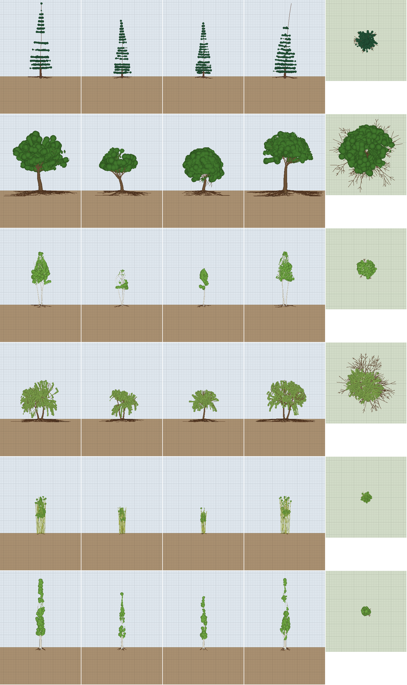
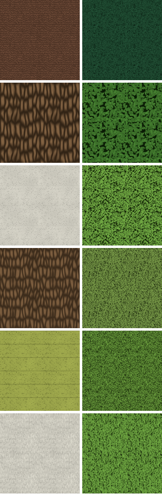

# Flora

Trees grow from a small **species genome**. One recursive branching process,
in `crates/mechanic-world/src/generation/flora`, makes every species. Spruce,
oak, birch, willow, bamboo, and poplar differ only in the numbers in
[`worldgen/flora.ron`](../crates/mechanic-world/worldgen/flora.ron).



The rows are spruce, oak, birch, willow, bamboo, and poplar, each at four seeds.
The last panel in each row is a top view. Grid lines are 1 m apart, with a
heavier line every 5 m.

## The genome

| Field | Type | What it does | Measure it owns |
|---|---|---|---|
| `height` | `(lo, hi)` m | Mature height. Each tree draws its own from the range. | measured height |
| `width` | ratio | Crown diameter ÷ height. It bounds every branch through the crown envelope. | crown width ÷ height |
| `girth` | ratio | Trunk base diameter ÷ height, shared among the stems. Every other radius follows the pipe model. | base diameter ÷ height |
| `stems` | `(min, max)` | Stems rising from the base, spread on a disc. | stem count |
| `crown_base` | 0..1 | Fraction of the height left as bare trunk before the first split. | lowest foliage ÷ height |
| `dominance` | 0..1 | Apical dominance. It sets the chance the leader survives a split; otherwise the leader forks into co-dominant limbs. It also blends the crown envelope from a dome (0) to a cone (1). | how high the original leader reaches ÷ height |
| `split_chance` | 0..1 | Chance that a node splits. | fraction of nodes that split on laterals |
| `split_count` | `(min, max)` | Children per split: whorls on stems, at most one per side on laterals. | children per split |
| `split_angle` | degrees | Angle between a child and its parent. | first-order branch angle from vertical |
| `tropism` | −1..1 | Bend per node after a lateral leaves its parent. Positive seeks the sun and negative hangs. Thin, flexible branches bend most. | mean rise of unbranched twigs |
| `wobble` | 0..1 | Random kink per segment. | stem path length ÷ chord |
| `foliage` | `(look, size, density)` | `look` is the surface look that colours the leaves. `size` is the sleeve radius around terminal wood. `density` is the filled fraction of the sleeve. | foliage volume; filled fraction |
| `bark` | look | Surface look that colours the wood. | — |
| `roots` | `(spread, depth)` | `spread` is root radius ÷ crown radius; `depth` is how deep the roots go before levelling off, in metres. | root radius; root depth |

`cargo test -p mechanic-world flora` checks the table in
`every_genome_field_moves_its_own_metric`. It sweeps every field across its
range on an oak, using 8 seeds at each of 7 steps, and requires two things:
- each field moves its own measure monotonically (Spearman ρ ≥ 0.9);
- no two fields have the same effect, i.e. their scaled effects on every
  measure must not point the same way (|cos| < 0.9).

The sweeps are defined once, in `GenomeSweep::ALL`, and the gallery draws them.

## How a tree grows

1. **Draw the tree.**
   - Height `H` comes from `height`, crown radius `R = width·H/2`, and trunk
     radius `r0 = girth·H/2`.
   - Each of the `n` stems starts with radius `r0/√n`, standing on a
     golden-angle spiral.
   - With several stems, each leans outward by `split_angle·(1 − dominance)/2`.
   - A short flare cone, 1.4× wider over 0.3 m, roots each stem.
2. **Grow each axis.**
   - Each axis runs in `clamp(round(length·20/H), 2, 20)` segments.
   - Radius tapers linearly toward the twig radius (half a 5 cm cell).
   - Wobble kinks every segment.
   - Tropism bends laterals from their second node on, weighted by
     `(1 − r/r0)²`, so leaders hold their line.
3. **Split.**
   - A node splits with probability `split_chance`. Stems start splitting only
     above `crown_base`.
   - **The leader survives** (probability `dominance`): laterals leave at
     `split_angle`, with radius `r·lerp(0.7, 0.35, dominance)`, and the
     leader keeps what the pipe model leaves it.
     - On stems they spiral by the golden angle.
     - On laterals they are flat: at most one to each side, in the branch's
       horizontal plane.
   - **The leader forks** (probability `1 − dominance`): two or more
     co-dominant children of radius `r/√m` take the remaining length, at up to
     30° apart.
4. **Lengths.**
   - A stem's lateral is as long as it must be for its **tip** to land on the
     crown envelope. The envelope is `lerp(dome, cone, dominance)·R`, less the
     foliage radius.
   - Deeper laterals are 0.6 of what remains of their parent.
   - Branches are at most 240× their base radius long.
5. **Bounds.**
   - Laterals that leave the crown envelope are pruned. Co-dominant forks turn
     back in along its edge instead.
   - Roots stop at `spread·R`, never climb, and level off at `depth`.
   - Wood stops 0.4 m above the ground, so hanging twigs end short of it.
6. **Foliage.**
   - Every non-stem axis carries a capsule sleeve of radius `size` beyond its
     last split, and a ball 1.3× wider at its tip.
   - Holes dent the blobs' union from outside: smooth noise sets how deep,
     from nothing to the full blob radius. The noise is remapped through its
     own distribution, and its target is biased so that `density` is the
     filled fraction (`foliage_density_sets_filled_fraction`).
   - The noise's wavelength is 1.25 × its steepest slope × the dent depth, so
     a dent never changes faster than distance. Walking from any leaf toward
     its twig, the foliage only gets denser: no leaf clump floats free.
7. **Roots.** Five main roots, plus a taproot when `depth > spread·R/2`, grow by
   the same process with fixed branching numbers.

Recursion needs no depth limit in the genome. A branch thinner than half a
cell can no longer split. `MAX_ORDER = 6` and a 20,000-segment budget are
safety stops that no preset reaches.

A `TreeModel` holds tapered capsules for wood and roots and capsules for
foliage, indexed by 1 m buckets. `TreeModel::sample` returns a signed
density, exact to 0.3 m outside every primitive, together with the part that
dominates: wood, root, or foliage.

Every lattice draws wood at least 0.9 lattice spacings thick
(`sample_at_stride`): 4.5 cm at the finest level, 18 cm at the 20 cm stride.
No point on a branch's axis lies farther than half a cube diagonal (0.87
spacings) from a lattice corner, so every point of the axis has a solid
corner beside it, and those corners join edge to edge. Thinner wood broke
into floating shards: 933 pieces on one spruce at the finest level.
`every_branch_holds_together_at_every_grown_stride` and
`no_wood_or_crown_floats_at_coarse_levels_of_detail` hold both the model and
the meshed field to this.

## Bark and leaves

Each species' bark and leaf maps are drawn from the same genome that grows
it (`flora/texture.rs`). The look a species names only colours them. The maps
hold light and shade, a normal map, and occlusion and roughness. They tile
every 1.5 m, the terrain's texture repeat, at 512 pixels (3 mm each).

**Bark** (`BarkTraits`):

| Trait | Read from | Effect |
|---|---|---|
| Fissure depth and plate width | `girth`: a trunk thick for its height is old | Oak's furrows are 3 cm deep between 15 cm plates. Birch's are 4 mm. |
| Plate length | `split_count`: splitting many ways at once breaks plates into scales | Spruce plates are about twice as long as wide. Birch's are over three times. |
| How plainly plates show | old bark, or scales | Oak and spruce show plates. Birch and bamboo are smooth. |
| Fissure wander | `wobble` | Oak's fissures wander; poplar's run straight. |
| Lenticels | smooth bark × `dominance`, fewer where splits are many | Birch and poplar show thin dark dashes. |
| Node rings | smooth bark × `stems` | A many-stemmed clump grows rings, one per internode: bamboo. |

**Leaves** (`LeafTraits`):

| Trait | Read from | Effect |
|---|---|---|
| Length | `foliage.size` | Oak leaves are 12 cm, spruce needles 6 cm. |
| Breadth | `foliage.size`: a deep crown has broad leaves, a shallow one needles | Oak leaves are 1.5 times as long as wide. Spruce and willow leaves are about 6 times. |
| Direction | `tropism` | Willow leaves hang straight down. Poplar's point up. |
| Spread | `split_angle`, narrowed by strong tropism | Oak leaves point every way; willow's hang together. |
| Cover | `foliage.density` | The rest is the shadowed crown behind. |
| Lobes | `wobble` × breadth | Only the oak's leaves are lobed. |

The terrain shader samples tree maps from their own texture arrays, so the
1536-pixel ground layers stay as they are. Bark and hanging leaves need an
up direction. On faces facing along x, the shader swaps the repeat's axes
for tree maps, so fissures run up the trunk on every side. That swap made the
terrain pixel test's blended case drift, through undefined implicit
derivatives. Every textured lookup now takes explicit gradients (see
[terrain materials](terrain-materials.md)).



## Gallery

```
cargo run -p mechanic-bench --release --bin flora-gallery -- --out <dir> [--sweep all|<field>] [--species oak] [--flora <file>] [--seeds 4] [--no-voxels]
```

It writes these images:
- `sheet.png`: the picture above.
- `species-<name>.png`: two trees, larger.
- `voxels-<name>.png`: the tree as terrain cells.
  - the front-most solid 5 cm cells;
  - the same at the 20 cm stride of the second level of detail;
  - a slice through the trunk that shows the holes in the foliage.
- `sweep-<field>.png`: seven steps of one field on the base species, two seeds
  each.
- `texture-<name>.png`: the species' bark and leaf maps, lit, coloured, and
  tiled two by two. `textures.png` shows them all.

It prints one JSONL line per tree, with every measure, `grow_ms`,
`sample_ns_per_cell` and `filled_fraction`, and one per sweep step.

In the release build on the M1 Pro, every preset grows in under 2 ms with at
most about 3,000 segments. A density sample costs 15–130 ns.

## Tuning log

These are visual verdicts on `sheet.png`, phase 1. Each species must be
recognisable by silhouette alone.

| Round | Change | Verdict |
|---|---|---|
| 1 | First presets | Oak is an umbrella, willow hangs through the ground, the spruce top droops and forks, roots climb into the air. |
| 2 | Tropism only on laterals, roots never climb, wood stops above ground, 20 internodes | Spruce is a cone, but its low whorls make a ball. Oak, bamboo, and poplar read correctly. Poplar grows whips above the crown. |
| 3 | Slenderness cap, flat laterals | Poplar is a column. The willow's short twigs do not hang. |
| 4 | Tropism per node, not per metre | Willow weeps. |
| 5 | Laterals split at most once to each side | The spruce ball is gone: clean whorls to the ground. |
| 6 | Crown envelope prunes laterals; forks bend back in; tips aim at the envelope | `width` and `dominance` now control the crown. Birch is a slender oval on pale stems. Every species reads correctly. |
| 7 (phase 2) | Foliage holes widened from 15 to 40 cm for terrain cost | Leaves read as clumps with gaps rather than lace. Every species still reads correctly. |

Final verdicts:
- **Spruce:** a narrow cone of flat whorls to the ground, dark needles.
- **Oak:** a broad dome on a short, gnarled bole with heavy surface roots.
- **Birch:** one to three pale, slender stems under a light, oval crown.
- **Willow:** a rounded crown with curtains hanging almost to the ground.
- **Bamboo:** a dense clump of straight culms, leafy in the upper half.
- **Poplar:** a tall, narrow column.

## Trees in the world

**Placement.**
- Biomes list their trees in `flora`; see [world generation](world-generation.md#flora).
- Each tree is a pure function of the world seed, its layer and its grid
  cell. Placing one costs about 25 ground samples and is cached per thread.
- Growing one takes about a millisecond. Grown trees live in a shared cache
  with a 192 MB budget, behind a small per-thread table.

**In the terrain field.**
- The field's density is `max(ground, tree)`, so trees are ordinary terrain.
- Wood is the `Wood` material. Leaves are `Foliage`.
- Each species a biome grows gets two palette looks of its own,
  `<species>/bark` and `<species>/foliage`. Each is a copy of the look the
  genome names, drawing the species' own maps.
- Digging, breakage, clumps and the matter books treat both like any other
  ground:
  - **Wood** is strong, light (600 kg/m³) and stays in pieces when cut, like
    ore.
  - **Foliage** gives way under a few kPa (`foliage_breaks_where_soil_holds`)
    and crumbles into clods.
- Neither erodes. The terrain brush does not lay them: the hotbar and
  material wheel offer `TerrainMaterial::BRUSHABLE`.

**Roots.**
- Roots add no ground; they paint as wood the ground they run through, below
  its top 0.3 m.
- Grass, water and erosion therefore keep their topsoil, and digging near a
  tree turns up wood.

**Water.**
- Water runs through leaves but not wood (`water_runs_through_canopies_but_not_trunks`).
- `TerrainField::water_density` and `water_density_lattice` see the ground
  that way, and native grass is found under trees.

**Distance.**
- Terrain sampled at up to a 20 cm stride (levels 0 to 2, out to 22–64 m)
  shows grown trees.
- Coarser levels draw each tree from its species' octree (`flora/lod.rs`),
  which needs no growing per tree:
  - Four trees of each species are grown once, at its tallest height, when a
    lattice first needs one. Each placed tree takes one by its seed, shrunk
    to its own height and turned about the vertical.
  - The finest level holds how much of each 40 cm cell is wood and how much
    is leaves. Each coarser level merges eight cells below it, as the
    terrain octree's levels do, seen through three layers of them: a crown
    with gaps between its clumps reads as solid from afar, while a lone twig
    averages away.
  - A lattice reads the finest level whose cells are at least 1.5 spacings
    wide. Its surface lies where cells are 40 % full, so a branch one cell
    thick is as thick as the lattice holds in one piece.
  - Whatever a level draws is joined to a stem and drawn as whole cells, so
    no neck between cells is thinner than the lattice holds. Wood too thin
    to draw that joins a clump to its stem is filled in along the shortest
    way; clumps with no way to a stem are thinned away.
  - A tree's octree never reaches past the bounds its placement claims, so
    a tree looked up at a point and one raised over a lattice agree, and
    transition seams close.
  - Stems are capsules no thinner than the lattice holds, up to a cell into
    the lowest leaves the level draws.
  - `flora-gallery` writes `lod-<species>.png`: each level as lattices
    0.4, 0.8, 1.6 and 3.2 m apart draw it, beside the grown tree.

**Bounds.**
- `classify` and `interval` are tree-aware from cheap placement bounds, so no
  box holding a tree is ever judged empty.
- Meshing culls blocks by the ground alone and raises the trees over every
  block afterwards.

**Ground queries.** `topmost_surface` and `surface_height` find the ground
under any canopy.

### Cost

`terrain-cut` (release, seed 42, 10 workers, M1 Pro) compares each biome's
full streaming cut with and without its flora. CPU is sampling plus
extraction.

| Biome | CPU without trees | CPU with trees | Ratio | Triangles without → with |
|---|---|---|---|---|
| Verdant Hills | 161.6 s | 192.7 s | 1.19× | 9.7 M → 19.0 M |
| Titan Crags | 220.4 s | 239.2 s | 1.09× | 10.6 M → 14.0 M |
| Shelf Mire | 145.3 s | 153.6 s | 1.06× | 7.3 M → 8.4 M |

Selection takes about 1 s longer per cut, from tree placement.

After wood was thickened to its lattice and foliage holes became
slope-limited dents (2026-10-03, same machine under load), Verdant Hills
costs 175.8 s without trees and 206.2 s with them: 1.17×. Its triangles went
from 9.7 M to 15.8 M, fewer than before because the holes are larger.

Measure a change by copying `crates/mechanic-world/worldgen` with the
`flora` lists removed and running `terrain-cut --worldgen <dir>` against
both.

### Known limits

- Twigs are drawn as thick as the lattice can hold them, so distant trees
  look stouter: twigs are 36 cm across at the 20 cm stride.
- Reloading worldgen while the app runs keeps the tree maps it started with.
- There is no growth, felling, or tree-specific harvesting: trees are part of
  the seed's ground.
- Saved worlds made before trees are outdated by the new worldgen digest and
  brick format, and are not migrated.

## Decisions

- **Measures.**
  - `dominance` owns how far the leader reaches, not where the crown is widest.
    Widest height also depends on `split_angle`, because a 45° branch cannot
    reach out far inside a narrowing cone.
  - `split_chance` owns the fraction of nodes that split, counted on laterals
    thick enough to split. Total segment count also grows with crown size, so it
    tracked `crown_base`.
  - `wobble` owns stem tortuosity, which tropism cannot touch.
- **The cross-field check** is the plan's pruning rule: no two fields may have
  the same effect. A first version required that no field move another
  field's measure more than that field does. Crown width and shape emerge from
  several fields by design, so that version failed for reasons that were not
  defects.
- **No genome field was pruned.** All fifteen pass monotonicity and
  distinctness, `wobble` and `crown_base` included.
- **Preset changes from the plan's starting values:**
  - spruce: `dominance` 1.0, `girth` 0.028
  - oak: `tropism` 0.12
  - birch: `girth` 0.028, `split_chance` 0.6, `split_count` (2, 3), `split_angle` 40, `tropism` −0.35, `foliage` size 0.55 and density 0.55
  - willow: `crown_base` 0.3, `tropism` −0.95
  - bamboo: `width` 0.3, `girth` 0.03, `dominance` 0.9, `split_chance` 0.3
  - poplar: `dominance` 0.85, `girth` 0.036
  - Girth was raised on the three slenderest species after the first look in
    the app: their trunks read as sticks at 5 cm cells.
- **Validation errors use the existing `WorldgenError::Invalid`**, naming the
  species. A dedicated variant would add nothing.
- **Images:** the sheet lives in `docs/flora/`, following the per-feature image
  folders used elsewhere in `docs/`.
- **Roots paint, they do not build.**
  - First version: roots added solid ground. Shore oaks then pushed roots out
    of the soil into lakes and channels, damming them.
  - Second version: roots repainted the topsoil as wood, so it stopped
    eroding and soaking.
  - Now roots only repaint ground below its top 0.3 m.
- **`topmost_surface` passes through trees.**
  - Its callers place spawns, pits, vehicles and benchmark probes on the
    ground.
  - Tests of the ground's own shape use `testing::treeless_field`. These
    include LOD smoothness, and two water tests whose helpers stood on
    canopies.
- **`TreeModel::sample` reports only true densities within 0.3 m.** A floor
  of −0.3 lifted the ground's own density wherever a tree's bucket overlapped
  it, moving the terrain surface.
- **Trees paint the open side of their surface too.** A mesh crossing takes
  its open corner's look, so air corners beside a trunk must know the trunk.
- **Placement asks for open sky up to the tallest tree and a level 1 m
  footing.**
  - Without the sky check, trees grew through carve roofs.
  - Without the footing check, trees stood on ledge edges.
  - The footing check replaced a local slope probe.
- **Bark and leaves are procedural, per species.**
  - The first version recoloured the shipped wood and grass textures.
  - The maps are drawn on background threads when a world is entered, one
    thread per map, while the ground layers load. In release, under load on
    the M1 Pro, bark takes about 80 ms and leaves 55–170 ms; spruce needles
    are the slowest (`texture_ms` in the gallery's JSONL).
  - They live in their own 512-pixel arrays, about 33 MB for the four
    species the default biomes grow. In the 1536-pixel ground arrays they
    would have cost about 300 MB.
- **Chunk caps through crowns are painted.** A chunk's cap faces close it
  where it meets its neighbours. Meshing painted only cap corners within
  three samples of a surface, and left deeper ones as plain rock. Impostor
  crowns are metres dense, so their caps drew grey stone blended into the
  leaves, which read as camouflage on every distant crown.
  - Even painted, a corner fell back to ground rules about half the time.
    The lattice stores densities as f32, so rounding up let the stored
    value beat the very tree that set it. Trees now compare at f32
    precision (`crowns_and_their_chunk_caps_are_painted_as_trees`).
- **Extra surfaces merge by what they draw.** A chunk holds eight surfaces.
  Rarer ones merged into one with the same texture set, so leaves (Grass)
  could become the meadow. They now merge into one that draws the same map,
  else the same material, else the same set.
- **Foliage holes are as wide as the leaves are deep.**
  - First version: 0.15 m holes. The finer sponge tripled a woodland's
    triangles.
  - Second version: 0.4 m holes, cut anywhere in the blob. These left leaf
    clumps floating beside the crowns.
  - Third version: radial holes, read where each direction from a twig
    meets its blob. These cannot float, but overlapping blobs each fill
    independently: a density of 0.2 filled 75 %.
  - Now one dent field, gentler than distance, cuts the blobs' union:
    holes span 1.6 m on a spruce and 5.7 m on an oak.
- **Wood is never thinner than its lattice can hold.** Without this floor,
  twigs and the tops of slender trunks broke into floating shards at every
  level. Impostor trunks were 10 cm thick on 40 cm lattices. Edits keep the
  finest level's densities, so dug wood far away is drawn at its true
  thickness.
- **Distant trees come from octrees, not impostors.** Impostors were a trunk
  under a solid cone or dome: every distant tree of a species looked alike,
  and nothing like the trees it stood for. Octrees of real trees keep each
  species' crown, at a few milliseconds per species to build. Growing every
  tree within the 1 km horizon would cost a megabyte and a millisecond each
  for tens of thousands of trees. On 2026-10-04 (`terrain-cut`, seed 42, M1
  Pro under load), Verdant Hills went from 15.8 M to 17.3 M triangles, mostly
  at the 40 cm level, where the octree's crowns are rougher than the
  impostors' domes, and from 187 s to 193 s of sampling CPU. All biomes
  together went from 111.6 M to 116.9 M triangles.
- **Transition seams resample trees at the coarser stride.** Each stride
  draws trees differently, so the points a transition face shares with its
  coarser neighbour are sampled as the neighbour samples them wherever
  trees reach, as edited ground already was. That sampling also closes
  caves as the coarser stride does.
- **Grown trees end at the 20 cm stride; octrees take over.** With grown
  trees at 40 cm, Verdant Hills cost 2.5×. Most of that was culling by the
  tree-aware interval and painting by per-vertex tree lookups. Both are now
  gathered once per lattice.

