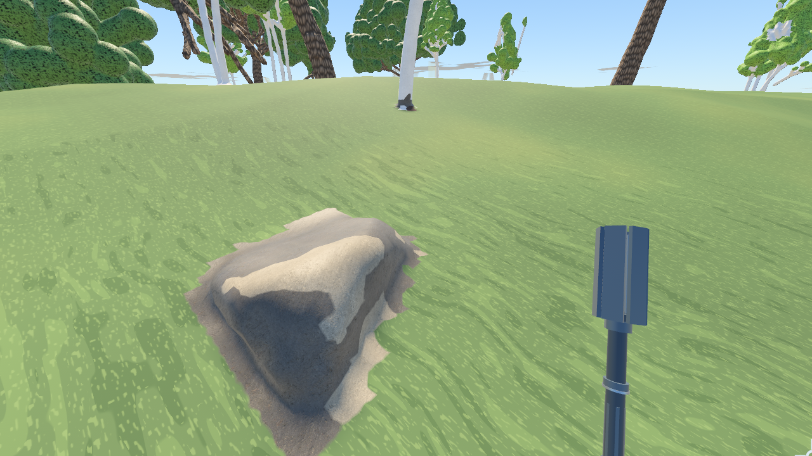
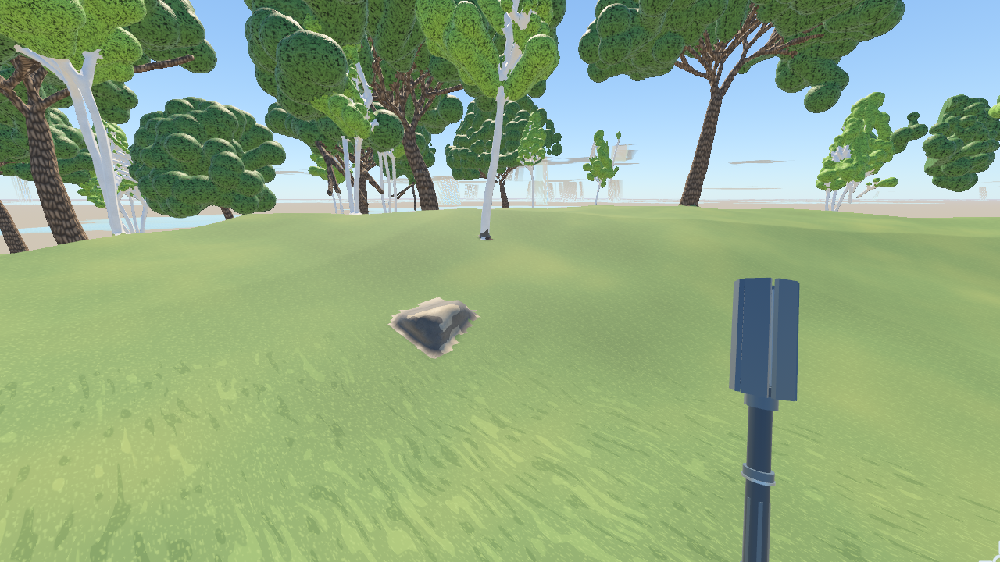
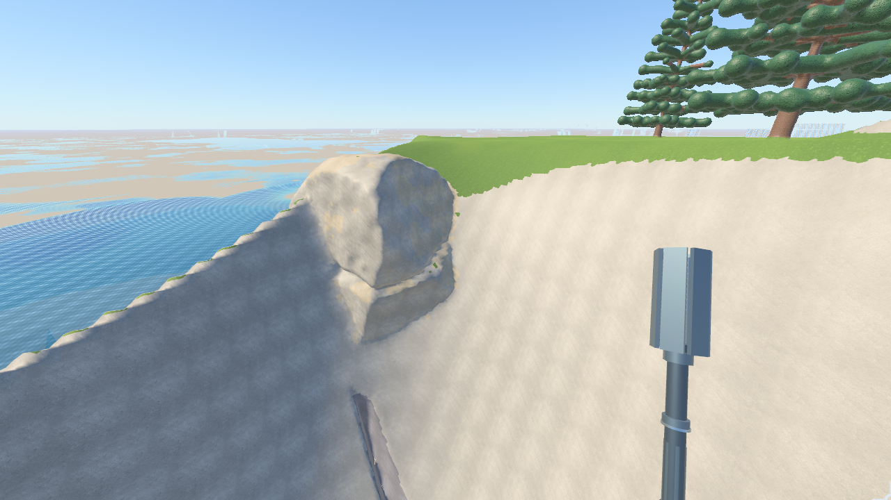
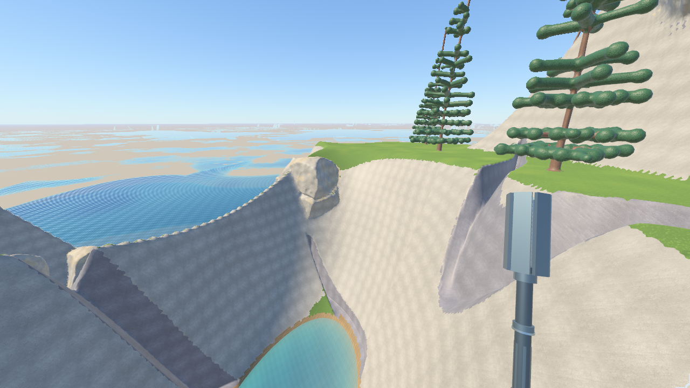

# World generation

Untouched terrain is a pure function of the seed and a declarative
definition: RON files in `crates/mechanic-world/worldgen/`. A biome is a
single file, and adding one means writing that file and listing it in
`world.ron`. The code in `crates/mechanic-world/src/generation*` is the
engine that reads those files. It holds no terrain shapes of its own.

Everything is full 3D density: positive is solid, and the value roughly
measures metres to the surface. The octree, edited bricks, Transvoxel meshing,
queries and physics all consume the same `TerrainField::sample_cell`
contract they always did.

## Pipeline

1. **Climate.** Four `(x, z)` fields from `world.ron`: temperature,
   humidity, continentalness and weirdness, each roughly in [-1, 1].
2. **Biome weights.** Every biome names a target point in climate space, and
   may leave some axes out. The nearest target wins. Biomes within `blend` of
   the nearest share the column with cubic falloff weights. `rarity` pushes a
   biome's target away. Around the origin, `spawn` forces its biome.
3. **Biome density.** The column's biomes each evaluate their `density`
   expression, and the results are summed by weight. Shape languages
   therefore fade into one another across a border instead of switching
   abruptly.
4. **Rivers.** When the field is built, blended biome heights are sampled on
   a 32 m grid over the whole 16 km world. Depressions are filled with
   priority-flood (Barnes et al. 2014). Flow follows the steepest filled
   descent, and cells whose upstream area exceeds `source_area` become
   channel segments. The density is then capped at a valley surface: a
   parabolic channel inside the banks, walls that rise at `bank_slope`
   outside them, and a fade back to untouched ground about 140 m out. River
   beds never rise downstream, and every river ends at the sea (connected
   ground below `sea_level` of at least the water section's `sea_area`) or
   at the world's edge. Smaller hollows fill as lakes. The sea, lakes and rivers are then
   filled: see [Water](water.md).
5. **Carve layers.** Each layer in `world.ron`'s `carves` is a void
   density, positive where it is open, gated by how much rock must stay
   above it. See [Carve layers](#carve-layers). A biome's
   `carves: {"name": factor}` closes a layer at 0 and widens it above 1.
6. **Limits.** Ground is solid below `vertical.0` and empty above
   `vertical.1`.
7. **Surfaces.** The biome with the largest weight at a point paints it, with
   a little noise dithering the choice along borders. It uses the first
   `surface` rule that matches the point's depth below the surface, the
   normal's up component, its altitude, how near a river it is, which carve
   layer opened it (`Carved`), local established water depth (`WaterDepth`),
   or the value of any expression. The rule names
   a palette surface. That surface decides the physical `TerrainMaterial`
   (how the ground digs and compacts) and the look: texture family, tint,
   recolour, roughness and repeat. Grass, dirt and stone are drawn
   procedurally unless the player switches it off, and ignore the repeat;
   see [Terrain materials](terrain-materials.md).

## Water-aware surfaces

`WaterDepth(min, max)` matches inclusive signed metres below the local established
sea, lake or river level. Negative depths are shore above water. It fails outside
the body's existing coverage and in sealed caves; surface-breaking sea trenches
qualify. The shared cell and mesh painter estimates the terrain surface from
signed density and gradient before comparing heights, so empty coarse samples
above water still paint submerged ground consistently through LOD transitions.

Bed rules precede vegetation and snow. Sediment is 0.8 m thick on faces whose
upward normal component is at least 0.55, and extends 0.35 m vertically above
the waterline. Steeper wet faces expose biome rock. Existing material blending
handles transitions; the palette supplies both appearance and physical material.

| Biome | Bed and bare shore |
|---|---|
| Verdant hills | Mire mud under standing water, existing gravel near river centres, loam above water |
| Shelf mire | Mire mud |
| Sunken coast | Sand through 3 m depth, silt below it |
| Dune sea / arch steppe | Existing biome sand |
| Titan crags | Gravel and granite |
| Karst needles | Silt and limestone |
| Gyroid reef / drift isles | Violet or dark rock |

These rules use seed-established water, including elevated lakes, rather than
runtime water levels: draining a lake exposes its existing bed. New pools,
erosion, vegetation regrowth and player-authored materials are unaffected.
Deep mineral and unrelated dry-land and underground rules remain in place.

## Expressions

The domain is the current `(X, Y, Z)` in metres. The node types are:

| Kind | Nodes |
|---|---|
| Values | `X`, `Y`, `Z`, `C(v)`, `Ref("name")` |
| Arithmetic | `Add`, `Mul`, `Sub`, `Div`, `Neg`, `Min`, `Max`, `Abs`, `Length`, `Sin`, `Cos`, `Clamp`, `Remap`, `Smoothstep`, `Pow` (sign-preserving), `Spline`, `Lerp`, `Terrace` |
| Noise | `Noise(kind, fractal, octaves, freq, lacunarity, gain, amp, offset, dims, seed)`, where `kind` is `Simplex`, `SimplexSmooth`, `Perlin`, `Value`, `Cells` or `CellEdges`, and `fractal` is `Fbm`, `Ridged` or `Billow` |
| Lines | `Fissure(noise)`: horizontal metres to the nearest zero line of a 2D noise, `|n| / |∇n|`. `Sub(C(w), Fissure(..))` is a cut `2w` wide. |
| Ground | `Height(h)`, equivalent to `h - Y` |
| Solids | `Sphere`, `Box`, `Torus`, `Capsule`, `Cylinder`, `Cone`, `Plane`, `Gyroid` |
| Combining | `Union`, `Intersect`, `Subtract`, `SmoothUnion(k, ..)`, `SmoothIntersect(k, ..)`, `SmoothSubtract(k, a, b)` |
| Domain | `Translate`, `Scale`, `Stretch`, `RotateX`, `RotateY`, `RotateZ`, `Twist`, `Repeat`, `Warp`, `Domain` |
| Placement | `Scatter`: jittered-grid instances with per-instance random `vars`, yaw, tilt, a `ground` anchor, a `mask` and a `chance` |

Rules for names and noise:

- `Ref` resolves in this order: scatter vars, then the biome's `let`, then
  `"height"`, then `library.ron`.
- Carve layers can also read the world's fields: `ground` (blended biome
  height) and `base` (the regional low ground under it), both interpolated
  from the 32 m drainage grid; the four climate channels by name; and, in a
  void or a scatter shape inside one, `rock`, the biome density at the point.
- Identical noise nodes are the same noise. Give a node a different `seed` to
  decorrelate it.
- `dims: Two` noise is evaluated once per column, which is much cheaper than
  3D noise.

A scatter's `reach` must enclose its shape and fillet. Its `ground` and
`mask` use the enclosing terrain seed, so references to terrain height agree
with the ground being instanced onto. Its `seed` decorrelates placement,
rotation, vars and shape detail without changing those terrain fields.

### How a biome gets its own shape language

The draft biomes show the range the nodes cover:

| Biome | Shape language |
|---|---|
| **verdant_hills** | Familiar rolling FBm hills with weathered granite boulders embedded in them. The spawn biome. |
| **dune_sea** | Stretched, warped ridged noise on a nearly flat base. |
| **arch_steppe** | Terraced mesas. Scattered tori stand on edge and are half buried as arches. Strata grooves are cut by `Sin(Y)`. |
| **titan_crags** | Ridged mountains, terraced into cliff bands with weathered outcrops at their edges; a shared 3D warp pushes both into overhangs. |
| **karst_needles** | Concave spires rise from Voronoi cell centres, gathered into groves by a noise mask. Sinkhole funnels drop into shafts, and tunnels are twice as wide. |
| **gyroid_reef** | A warped gyroid lattice intersected with mound heights, giving porous, walkable tunnels. |
| **drift_isles** | One 3D-noise blob per Voronoi cell, squeezed into a band about 80 m up: floating islands with conical undersides. |
| **shelf_mire** | Scattered stacked caps on crooked stems over wet flats. |
| **sunken_coast** | A basin below sea level with scattered sea stacks. |

## Rocks and cliff formations

`library.ron` defines `weathered_rock`: curved shoulders interrupted by unequal
fracture faces, with independently varied proportions, lean, cut depth and
weathering. A seeded domain offset varies the relief between instances.
Shallow seams and bounded chips affect geometry; mineral grain comes from
triplanar diffuse, normal and roughness maps rather than extra mesh detail.
With procedural ground enabled, stone combines those maps with continuous
large-scale weathering and a smoothly distorted mineral domain; it no longer
paints closed polygon outlines over rock. Analytic texture gradients retain
filtering through the distortion.
The terrain stone maps use [Poly Haven Rock 01](https://polyhaven.com/a/rock_01),
with provenance and CC0 terms recorded beside the assets.

Verdant Hills embeds individual boulders in the turf with a small ground
fillet. Exposed tops and buried interiors remain rock. Titan Crags places
larger, aligned outcrops where four-metre probes find a terrace edge; broad
flat treads do not seed formations. The cliff and outcrops share a slow warp,
keeping their roots attached. Exposed upper faces have restrained weathering
variation, and snow can still settle on high tops.

These are ordinary terrain density: editing, collision, LOD bounds and
meshing all use the existing terrain path. Their definition change updates
the worldgen digest, so existing saves with the old digest are listed as
outdated, as with other world-generation edits.

Native-app capture configurations live in `docs/images/rocks/native/`.
From the repository root, set `MECHANIC_TERRAIN_CAPTURE` to either configuration
and `MECHANIC_SKY_TIME=10`, then run `cargo run -p mechanic-app`. This creates
a disposable world and waits for nearby streamed terrain and textures before
saving screenshots. The capture's adjacent JSON records camera positions,
terrain detail and remaining distant-streaming work. The application cameras
render to an owned 1280 × 720 image for GPU readback, avoiding background-window
surface capture. Historical CPU preview comparisons in `sampling.json` are retained as
authoring evidence; they predate the final shape revision.

Actual native-app views (M1 Pro, seed 42 for boulders and seed 7 for cliffs,
10:00 lighting, procedural ground enabled):

| Terrain | Close view | Gameplay distance |
|---|---|---|
| Boulder |  |  |
| Cliff |  |  |

The captures wait for local terrain. Distant terrain can still be streaming;
the adjacent JSON records that backlog. These are review evidence, not a claim
that the rest of the terrain renderer or the requested visual review is complete.
The [paired GPU report](images/rocks/native/gpu-cost.json) measures the stone
opaque pass at 11.84 ms before and 15.11 ms after on an M1 Pro at 4096 × 2524
(about +28%). Grass and soil changed by about +5% and +4%. This full-screen
material fixture is not a gameplay frame-time measurement. The existing
repetition test passes with a rock correlation of 0.406 against its 0.5 limit.

Intermediate diagnostics preserve the [outlined stone material](images/rocks/native/boulder-procedural-before.png)
and [overly rounded cliff shape](images/rocks/native/cliff-rounded-before.png).

For fast geometry authoring, `worldgen-preview --seed 42 --out <dir>
--view-target <x>,<y>,<z> --view-offset <dx>,<dy>,<dz>` writes a headless
`view.png`. This omits the app's terrain textures and lighting and cannot
establish final visual quality.

## Carve layers

A carve layer is a void expression plus a gate. The gate reads `rock`, the
blended biome density, which for a heightfield is exactly the depth below
the surface and for SDF shapes the distance into them. A layer opens only
where `rock` exceeds its `roof`, between its `floor` and optional `top`
heights. So a void keeps `roof` metres of rock to every face of the ground,
cliffs and overhangs included, and caves reach wherever rock is thick
enough, including high inside mountains and 3D shapes. Where `roof` drops to
zero or below, the layer breaks through the surface.

The shipped layers:

| Layer | What it cuts |
|---|---|
| `tunnels` | Flat-floored tubes, about 5 m wide and 3.5 m high, on levels that roll gently (under about 9°): two hung from `base`, one halfway up to the surface so mountains hold tunnels high inside, and one wandering between them. Each runs along a `Fissure` line on the map. Chambers join them, inside a sparse cave country. In entrance country the roof drops to −6 m and the tube's upper half rises into a slot, so tunnels walk out of hillsides and collapse into sunken lanes just under flat ground. |
| `entrances` | Walk-in ramps: an open cutting whose floor sinks about 18° below the real surface (measured through `rock`), roofed over once 4.5 m of rock lies above, ending in a chamber 28 m down among the tunnel levels. |
| `shafts` | Sinkhole funnels over shafts 44 m deep. Only Karst Needles lists it. |
| `ravines` | Cuts along `Fissure` lines whose width, depth and taper are expressions: ravines 10–40 m wide and 40–110 m deep in dry or high country, open where their roof is negative and buried as sealed rift caves where it is positive; ocean trenches 160–440 m wide and over 500 m deep, kilometres long, where continentalness is lowest. |
| `trenches` | The same cut a metre or two across, in patches anywhere. Too fine to see from afar, so it is only cut near (`visible: 0`). |

Scale is only a matter of values: one `Fissure` shape covers a metre-wide
ditch and a kilometre-long trench, as long as the width stays well under
the noise's wavelength (the first-order distance shifts both walls by about
`width × frequency × 10`, but keeps their separation). A void must stay well
below zero where its feature is absent or has ended, because a biome factor
above 1 widens every void by up to 1.5 m per unit. The world's `vertical`
floor is −640 m so the deepest cuts fit.

Beyond cave distance (level 3 and coarser), a layer is cut only where its
roof lets it breach (below 2 m) and within `visible` metres of rock, so
sealed tunnels cost nothing far away while ravines and trenches in the sea
floor still show. `worldgen-preview --carves` finds and draws examples of
each layer and reports how many ramp mouths reach a tunnel.

## Flora

A biome's `flora` list places trees, one species per layer, on a jittered
grid like `Scatter`:

```ron
flora: [
    (species: "oak", cell: 14, chance: 0.35),
    (species: "spruce", cell: 10, chance: 0.5, mask: Sub(Ref("height"), C(26))),
],
```

`species` names an entry in `flora.ron`. `cell`, `chance`, `jitter`, and
`seed` work as they do for `Scatter`. `mask` is an `(x, z)` expression that
must be positive, and may use the biome's own definitions and `height`.

A tree grows only where all of these hold:
- its biome dominates;
- the ground is dry, at least 0.2 m above standing water;
- the sky is open up to the species' tallest height;
- the ground 1 m out on every side lies within 0.6 m of the base.

The ground is searched within 12 m of the biome's height expression.

Trees are part of the terrain field:
- **Wood and foliage** are solid cells of the `Wood` and `Foliage` materials,
  painted with the species' `bark` and `foliage` looks from the palette.
- **Roots** add no ground. They paint as wood the ground they run through,
  below its top 0.3 m.
- **Distance:** terrain sampled coarser than 20 cm shows each tree as an
  impostor, its trunk under a solid crown of its envelope.
- **Ground queries:** `topmost_surface` and `surface_height` find the ground
  under the trees.

[Flora](flora.md) describes the genome every tree grows from.

## Authoring loop

- `cargo run -p mechanic-bench --release --bin worldgen-preview -- --seed 42 --out <dir> --worldgen crates/mechanic-world/worldgen --views`
  writes:
  - `biomes.png`: biome map with rivers and sea
  - `relief.png`: shaded relief painted with each surface's look
  - `section_<biome>.png`: a vertical slice through each biome
  - `view_<biome>.png`: a ray-marched view of each biome
  - with `--carves`, `carve_<n>_<layer>_<open|buried>_{view,section}.png`:
    close views and slices where each carve layer breaks the surface or runs
    buried

  It also prints a JSONL line with compile time, biome coverage, the spawn,
  and with `--carves` how many entrance mouths connect to a tunnel.
- `MECHANIC_WORLDGEN_DIR=crates/mechanic-world/worldgen cargo run -p mechanic-app`
  generates from the directory and regenerates the streamed terrain whenever
  a file changes. This works in debug builds only.
- A parse or compile error names the file, its line and column, and the path
  through `Ref`s. The app keeps the previous field and shows the error.

Changing any file changes the definition's digest. Worlds saved under
another digest are listed as outdated, because their edited bricks were
baked from the older ground.

## Streaming and cost

### Bounding regions

`TerrainField::classify` bounds a box by interval arithmetic over the
compiled tapes (Keeter 2020):

- **Noise** is bounded one octave at a time, by the tighter of two sound
  bounds:
  - the value at the box centre plus the octave's measured maximum slope
    times the box's reach;
  - a second-order Taylor bound: the value and gradient at the centre plus
    the measured maximum curvature. This is far tighter for octaves much
    wider than the box.
- **Solids** are bounded as 1-Lipschitz distances.
- **Scatters** are bounded by the instances whose reach touches the box.
- **Biome blends** are bounded from each biome's weight range over the box,
  not the hull of every nearby biome. The weight range intersects two
  bounds: the climate fields evaluated in interval arithmetic, and the
  extremes sampled on the 32 m drainage grid around the box. The blend
  bound then spends the weights on the largest (or smallest) biome values
  first. A gentle hill next to a mountain biome is therefore not bounded by
  the mountain's peaks.
- **River valleys** only rise away from their centre line, so each segment
  is bounded at the box's nearest point.

### What gets meshed

- **Mixed nodes only.** Selection meshes only nodes whose bound straddles
  zero.
- **LOD bands.** Levels 2–6 cover 64, 160, 400, 640 and 1,000 m. The
  coarsest level samples every 3.2 m in 102 m nodes.
- **Detail scale.** A scale between 1 and 0.35 shrinks every band except
  the horizon. The app lowers it one step at a time, by a fifth each time,
  while more than about 6M terrain triangles are resident. It raises it
  again once the settled cut falls well below that.
- **Enclosed voids** only appear in nodes of level 2 or finer, within about
  64 m. Coarser nodes keep only carves that can reach the surface (see
  [Carve layers](#carve-layers)), both when classified and when meshed.
- **Block culling.** 8³ lattice blocks proven empty or solid carry a bound
  in place of exact values. This is skipped wherever edits are present.
- **Coarse pre-check.** Before sampling a whole unedited chunk, a lattice
  four times coarser is evaluated. If every point has the same sign and
  lies more than two coarse spacings from zero, the chunk holds no surface
  and returns empty. Most chunks the bounds could not rule out end this
  way.

### Streaming order

Pending work is ordered by:

1. pinned and startup-critical nodes;
2. distance ring (16, 40, 64, 160, 400, 640 m);
3. within a ring, edited nodes, then nodes in the camera's view, then nodes
   seams depend on, then nearest first.

Distant seam work can therefore never hold up nearby ground. Jobs the cut
stops wanting are cancelled before they start.

### Evaluation and caching

Grid evaluation stores each op only over the axes it depends on. A
heightfield's noise is therefore computed once per column, and grid values
match point evaluation bit for bit, which edits rely on. Blocks stacked over
the same columns reuse those planar values.

A carve only shapes ground within 16 m of its void. Each block bounds every
layer first and skips those that cannot come that close, so a tunnel costs
nothing to the blocks away from it. `Fissure` is bounded from its value,
gradient and curvature at the box centre, which is tight to within the
box's reach.

Point queries such as breakage, soil, and physics probes go through
per-thread caches of columns and cell samples. They return identical values.

### Measured cost

Measured on an M1 Pro, 10 threads, with
`cargo run -p mechanic-bench --release --bin terrain-cut -- --seed 42`. It
meshes the whole cut around each biome's heart:

| Biome | Nodes | Triangles | CPU to mesh the cut | Without carve layers |
|---|---|---|---|---|
| verdant_hills | 9.6k | 10.1M | 152 s | 7.2k, 7.3M, 80 s |
| titan_crags | 13.3k | 10.7M | 210 s | 11.5k, 9.0M, 114 s |
| karst_needles | 21.6k | 12.5M | 256 s | 18.1k, 9.4M, 132 s |
| gyroid_reef | 11.0k | 20.9M | 170 s | 9.7k, 20.3M, 130 s |

About half the added cost is real geometry: tunnels, ramps and ravine walls
add nodes and triangles near the player. The rest is evaluating the voids
in blocks near them. `--worldgen <dir>` measures an authored definition, so
a layer's cost can be isolated by removing it from a copy.

## Open work

- **Water.** Standing water is implicit and does not yet respond to edits;
  see [Water](water.md).
- **Carves and drainage.** Rivers are traced before carving, so an open
  ravine does not redirect them. Connections between tunnel levels, and from
  ramps to tunnels, are likely rather than guaranteed.
- **Faster sampling.**
  - Scattered shapes with 3D-warped detail (Arch Steppe, Shelf Mire) still
    cost about 10× a heightfield biome per block.
  - Candidate approaches: band-limited evaluation (coarse interpolation of
    low-frequency subtrees) and batched noise.
- **Structures.** Deliberately out of scope for this system. Trees are
  [flora](flora.md).
